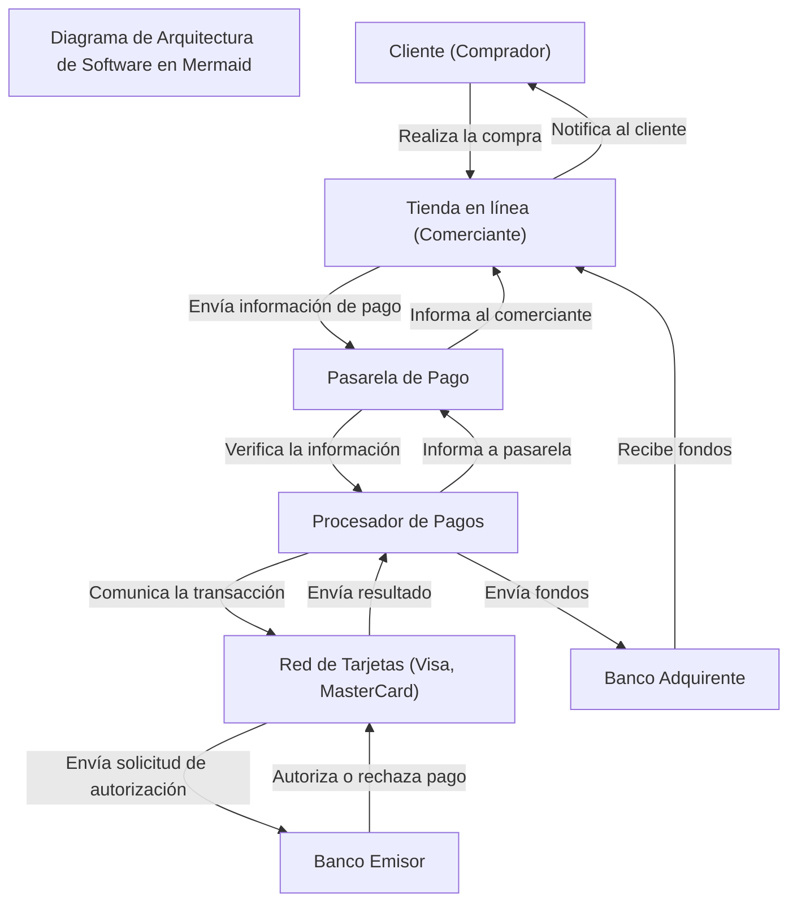

## Pregunta:

Diagrama de Arquitectura de Software en Mermaid: Crea un diagrama que visualice los componentes principales del sistema y cómo interactúan entre sí.

## Respuesta:

Aquí tienes un diagrama de arquitectura de software utilizando el lenguaje Mermaid, que muestra los componentes principales de una pasarela de pago y cómo interactúan entre sí:

## Explicación del Diagrama:

Cliente: El comprador ingresa los datos de pago y realiza la compra en la tienda en línea.
Tienda en línea (Comerciante): El sitio web del comerciante envía la información de pago a la pasarela de pago.
Pasarela de Pago: La pasarela cifra y transmite la información al procesador de pagos.
Procesador de Pagos: Procesa la transacción contactando con la red de tarjetas.
Red de Tarjetas: Facilita la comunicación con el banco emisor de la tarjeta.
Banco Emisor: Autoriza o rechaza la transacción según el saldo disponible y la validez.
Banco Adquirente: Recibe los fondos del pago y los deposita en la cuenta del comerciante.
Este diagrama muestra el flujo típico de una transacción a través de una pasarela de pago, destacando los componentes clave y sus interacciones.
