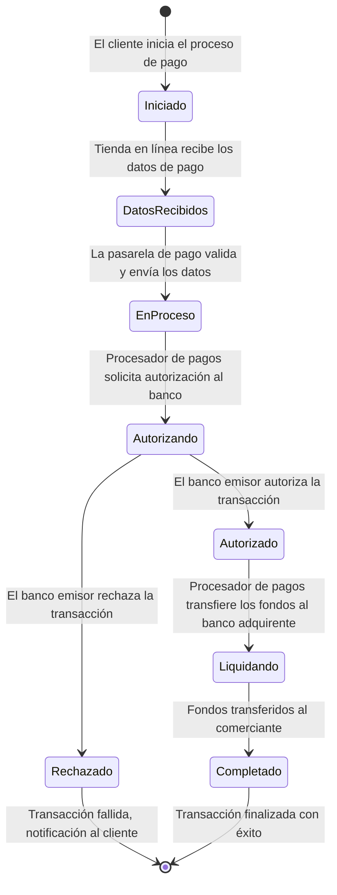

## Pregunta

tambien el Diagrama de Transición de Estados: Elabora un diagrama que muestre los distintos estados por los que pasa una transacción de pago desde su inicio hasta su conclusión.

## Respuesta

Aquí tienes un Diagrama de Transición de Estados en Mermaid, que representa los distintos estados por los que pasa una transacción de pago desde su inicio hasta su conclusión:

## Explicación de los Estados:

Iniciado: El cliente comienza el proceso de pago.
DatosRecibidos: La tienda en línea recibe los datos de pago del cliente.
EnProceso: La pasarela de pago valida los datos y los envía al procesador de pagos.
Autorizando: El procesador de pagos solicita la autorización al banco emisor a través de la red de tarjetas.
Autorizado: El banco emisor autoriza la transacción y permite continuar el proceso.
Rechazado: La transacción es rechazada debido a fondos insuficientes, problemas de seguridad u otros motivos.
Liquidando: El procesador de pagos transfiere los fondos al banco adquirente.
Completado: Los fondos son transferidos al comerciante y la transacción se completa con éxito.

## Transiciones:

Una transacción puede finalizar en dos estados:
Transacción fallida si es rechazada.
Transacción finalizada con éxito si es autorizada y completada.
Este diagrama captura el flujo de estados por los que pasa una transacción de pago en un entorno típico de comercio electrónico.
