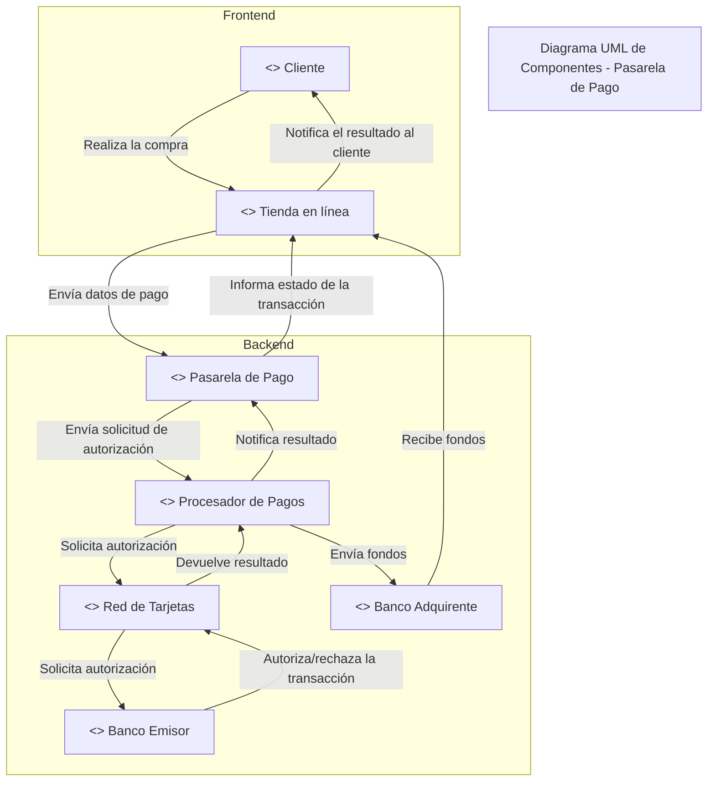

## Pregunta:

ahora el Diagrama UML de Componentes: Desarrolla un diagrama UML que muestre los componentes del sistema y sus relaciones.

## Respuesta:

Aquí tienes un Diagrama UML de Componentes que muestra los principales módulos de una pasarela de pago y sus interacciones. El diagrama en formato de Mermaid visualiza los componentes del sistema y sus relaciones:

## Explicación del Diagrama UML de Componentes:

## Frontend:

Cliente: Representa al usuario que interactúa con la tienda en línea.
Tienda en línea: Componente que gestiona la interfaz de usuario y envía las transacciones de pago.

## Backend:

- Pasarela de Pago: Recibe la información de pago del frontend y actúa como intermediario entre la tienda y los servicios de procesamiento.
- Procesador de Pagos: Procesa las transacciones y se comunica con la red de tarjetas y los bancos.
- Red de Tarjetas: Facilita la verificación y autorización entre el procesador de pagos y el banco emisor.
- Banco Emisor: Autoriza o rechaza la transacción de acuerdo con los fondos y validaciones del cliente.
- Banco Adquirente: Recibe los fondos de la transacción aprobada y los transfiere al comerciante.

Cada componente está representado de manera aislada para describir su función y cómo interactúan entre sí a través de líneas de comunicación.
