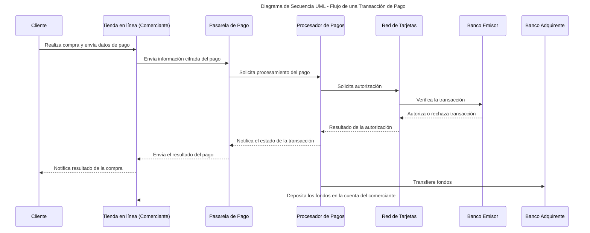

```mermaid

sequenceDiagram
    title Diagrama de Secuencia UML - Flujo de una Transacción de Pago

    %% Participantes del diagrama
    participant Cliente
    participant TiendaOnline as Tienda en línea (Comerciante)
    participant PasarelaPago as Pasarela de Pago
    participant ProcesadorPagos as Procesador de Pagos
    participant RedTarjetas as Red de Tarjetas
    participant BancoEmisor as Banco Emisor
    participant BancoAdquirente as Banco Adquirente

    %% Flujo de interacción
    Cliente ->> TiendaOnline: Realiza compra y envía datos de pago
    TiendaOnline ->> PasarelaPago: Envía información cifrada del pago
    PasarelaPago ->> ProcesadorPagos: Solicita procesamiento del pago
    ProcesadorPagos ->> RedTarjetas: Solicita autorización
    RedTarjetas ->> BancoEmisor: Verifica la transacción
    BancoEmisor -->> RedTarjetas: Autoriza o rechaza transacción
    RedTarjetas -->> ProcesadorPagos: Resultado de la autorización
    ProcesadorPagos -->> PasarelaPago: Notifica el estado de la transacción
    PasarelaPago -->> TiendaOnline: Envía el resultado del pago
    TiendaOnline -->> Cliente: Notifica resultado de la compra

    %% Liquidación de fondos (posterior)
    ProcesadorPagos ->> BancoAdquirente: Transfiere fondos
    BancoAdquirente -->> TiendaOnline: Deposita los fondos en la cuenta del comerciante

```
